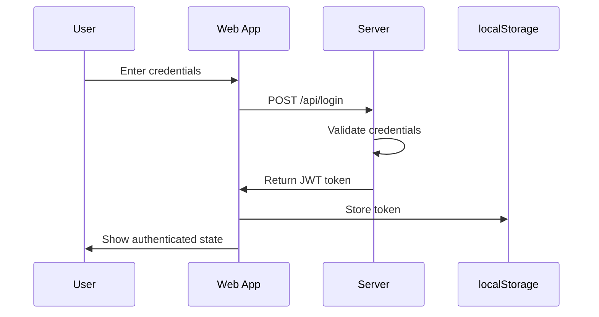
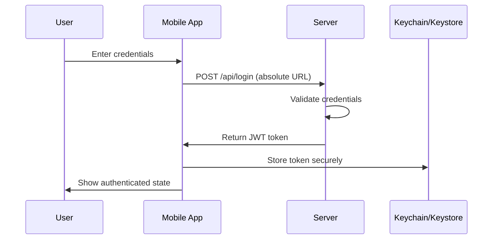

# JWT Auth Demo - Mobile & Web Application

A full-stack authentication application built with Node.js/Express backend and React frontend, enhanced with Ionic Capacitor for native mobile app deployment.

## 🏗️ Architecture Overview

This application demonstrates a complete authentication flow that works seamlessly across web browsers and native mobile devices (iOS/Android).

### High-Level Architecture

```
┌─────────────────────────────────────────────────────────────────┐
│                        Client Applications                      │
├─────────────────────────────────┬───────────────────────────────┤
│           Web App               │        Mobile App              │
│  (React + Vite + Tailwind)     │  (Capacitor + Native Plugins) │
├─────────────────────────────────┼───────────────────────────────┤
│ • localStorage for tokens       │ • Secure Storage (Keychain)   │
│ • Relative API URLs            │ • Absolute API URLs            │
│ • Standard web UI              │ • Safe Area support            │
│ • Browser-based auth           │ • Native mobile experience     │
└─────────────────────────────────┴───────────────────────────────┘
                                │
                                ▼
┌─────────────────────────────────────────────────────────────────┐
│                      Backend Server                            │
│              (Node.js + Express + Drizzle ORM)                │
├─────────────────────────────────────────────────────────────────┤
│ • JWT token generation & validation                            │
│ • User registration & authentication                           │
│ • Protected API endpoints                                      │
│ • CORS configuration for mobile                                │
│ • SQLite database with Drizzle ORM                             │
└─────────────────────────────────────────────────────────────────┘
```

## 🚀 Features

### Web Application
- **Framework**: React 18 with TypeScript
- **Styling**: Tailwind CSS with custom design system
- **State Management**: React Query for server state
- **Storage**: localStorage for JWT tokens
- **Build Tool**: Vite for fast development and building
- **Routing**: Wouter for lightweight routing

### Mobile Application
- **Framework**: Ionic Capacitor
- **Platforms**: iOS and Android
- **Secure Storage**: iOS Keychain / Android Keystore via `@aparajita/capacitor-secure-storage`
- **Safe Areas**: Proper handling of notches, status bars, and home indicators
- **Native Features**: Platform detection, secure token storage
- **UI**: Same React components with mobile-optimized styling

### Backend
- **Runtime**: Node.js with Express
- **Database**: SQLite with Drizzle ORM
- **Authentication**: JWT tokens with bcrypt password hashing
- **CORS**: Configured for mobile app domains
- **API**: RESTful endpoints for auth and protected data

## 📁 Project Structure

```
replit-capacitor/
├── client/                          # React frontend
│   ├── src/
│   │   ├── components/              # Reusable UI components
│   │   │   ├── ui/                  # Base UI components (shadcn/ui)
│   │   │   ├── auth-form.tsx        # Authentication form
│   │   │   ├── status-display.tsx   # Status messages
│   │   │   ├── mobile-info.tsx      # Mobile platform info
│   │   │   └── safe-area.tsx        # Safe area provider
│   │   ├── pages/                   # Page components
│   │   │   └── auth.tsx             # Main auth page
│   │   ├── lib/                     # Utilities and config
│   │   │   ├── auth.ts              # Auth functions
│   │   │   ├── config.ts            # API configuration
│   │   │   ├── secure-storage.ts    # Secure storage abstraction
│   │   │   └── utils.ts             # General utilities
│   │   ├── hooks/                   # Custom React hooks
│   │   ├── App.tsx                  # Main app component
│   │   └── main.tsx                 # App entry point
│   └── index.html                   # HTML template
├── server/                          # Express backend
│   ├── index.ts                     # Server entry point
│   ├── routes.ts                    # API routes
│   └── storage.ts                   # Database setup
├── shared/                          # Shared types
│   └── schema.ts                    # Database schema
├── ios/                             # iOS native project
├── android/                         # Android native project
├── dist/                            # Web build output
├── dist-mobile/                     # Mobile build output
├── capacitor.config.ts              # Capacitor configuration
├── vite.config.ts                   # Vite configuration
└── package.json                     # Dependencies and scripts
```

## 🔧 Development Setup

### Prerequisites
- Node.js 18+
- npm or yarn
- iOS Simulator (for iOS development)
- Android Studio (for Android development)

### Installation

1. **Clone and install dependencies:**
   ```bash
   git clone <repository-url>
   cd replit-capacitor
   npm install
   ```

2. **Environment setup:**
   ```bash
   cp .env.example .env
   # Edit .env with your mobile API URL
   ```

3. **Database setup:**
   ```bash
   npm run db:generate
   npm run db:migrate
   ```

### Development Commands

#### Web Development
```bash
# Start development server
npm run dev

# Build for production
npm run build

# Preview production build
npm run preview
```

#### Mobile Development
```bash
# Build for mobile
npm run build:mobile

# Sync with Capacitor
npm run cap:sync

# Open iOS project
npm run cap:open:ios

# Open Android project
npm run cap:open:android

# Run on iOS simulator
npm run cap:run:ios

# Run on Android emulator
npm run cap:run:android
```

## 🔐 Authentication Flow

### Web Authentication


### Mobile Authentication


## 📱 Mobile-Specific Features

### Secure Storage
- **iOS**: Uses Keychain Services for encrypted storage
- **Android**: Uses Android Keystore for encrypted storage
- **Web**: Falls back to localStorage
- **Implementation**: `@aparajita/capacitor-secure-storage`

### Safe Area Handling
- **Plugin**: `@capacitor-community/safe-area`
- **Features**: 
  - Automatic detection of safe area insets
  - Dynamic updates on orientation change
  - CSS variables for styling
  - Edge-to-edge display support

### Platform Detection
- **Capacitor Core**: Detects iOS, Android, or web
- **API Configuration**: Dynamic URL handling
- **UI Adaptation**: Platform-specific styling

## 🌐 API Configuration

### Web Configuration
- **Base URL**: Relative paths (`/api/...`)
- **Storage**: localStorage
- **CORS**: Handled by browser

### Mobile Configuration
- **Base URL**: Absolute URLs (`https://your-server.com/api/...`)
- **Storage**: Secure storage (Keychain/Keystore)
- **CORS**: Configured on server

### Environment Variables
```bash
# .env
VITE_MOBILE_API_URL=https://your-server.com
```

## 🎨 UI/UX Design

### Design System
- **Framework**: Tailwind CSS
- **Components**: shadcn/ui component library
- **Typography**: Custom font stack
- **Colors**: CSS custom properties for theming
- **Responsive**: Mobile-first design approach

### Mobile Optimizations
- **Safe Areas**: Proper spacing for notches and home indicators
- **Touch Targets**: Minimum 44px touch targets
- **Gestures**: Native mobile gestures support
- **Performance**: Optimized for mobile devices

## 🚀 Deployment

### Web Deployment
- **Platform**: Replit (or any Node.js hosting)
- **Build**: `npm run build`
- **Output**: `dist/` directory

### Mobile Deployment
- **iOS**: Build and deploy via Xcode
- **Android**: Build and deploy via Android Studio
- **Build**: `npm run build:mobile`
- **Output**: `dist-mobile/` directory

## 🔒 Security Considerations

### Token Storage
- **Web**: localStorage (consider httpOnly cookies for production)
- **Mobile**: Encrypted storage via platform keychain
- **Validation**: JWT signature verification

### API Security
- **CORS**: Configured for mobile app domains
- **HTTPS**: Required for mobile apps
- **Rate Limiting**: Consider implementing for production

### Best Practices
- **Environment Variables**: Store sensitive config in environment
- **HTTPS**: Always use HTTPS in production
- **Token Expiration**: Implement proper token refresh
- **Input Validation**: Validate all user inputs

## 🧪 Testing

### Web Testing
- **Unit Tests**: Jest + React Testing Library
- **E2E Tests**: Playwright or Cypress
- **Manual Testing**: Browser developer tools

### Mobile Testing
- **iOS**: Xcode Simulator and physical devices
- **Android**: Android Studio Emulator and physical devices
- **Cross-Platform**: Test on multiple devices and screen sizes

## 📚 Additional Documentation

### Project Documentation
- [Quick Start Guide](./QUICK_START.md) - Get up and running in 5 minutes
- [Mobile Setup Guide](./MOBILE_SETUP.md) - Detailed mobile development setup
- [Architecture Diagrams](./docs/architecture.md) - Visual system architecture

### External Resources
- [Capacitor Documentation](https://capacitorjs.com/docs)
- [React Documentation](https://react.dev)
- [Tailwind CSS Documentation](https://tailwindcss.com/docs)
- [Drizzle ORM Documentation](https://orm.drizzle.team)
- [JWT.io](https://jwt.io) - JWT token debugging

## 🤝 Contributing

1. Fork the repository
2. Create a feature branch
3. Make your changes
4. Add tests if applicable
5. Submit a pull request

## 📄 License

This project is licensed under the MIT License - see the LICENSE file for details.
