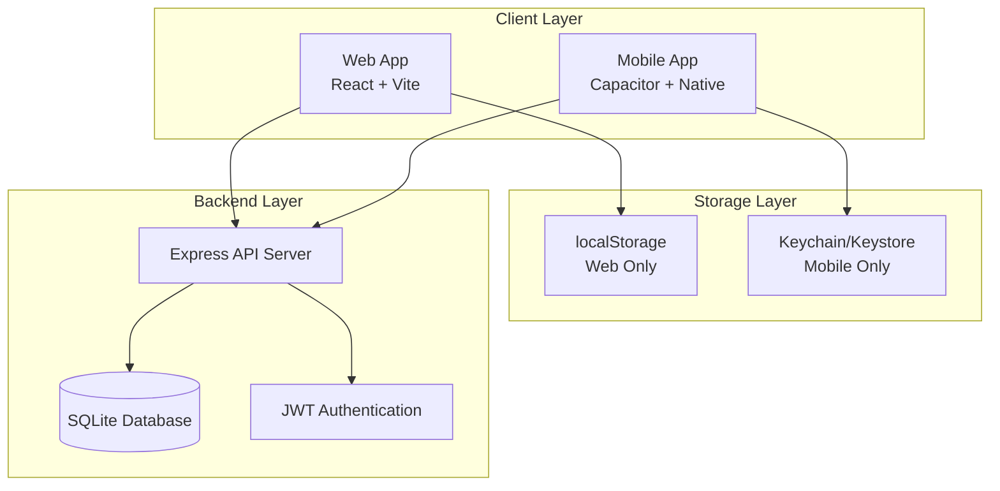
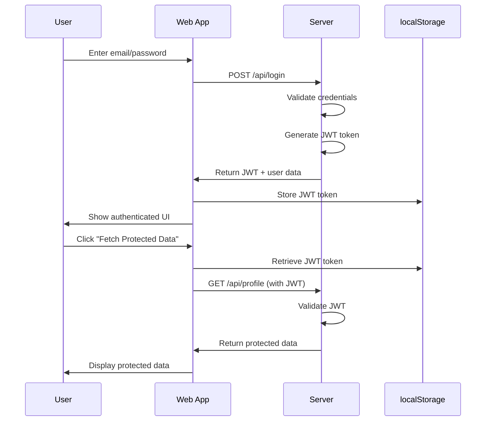
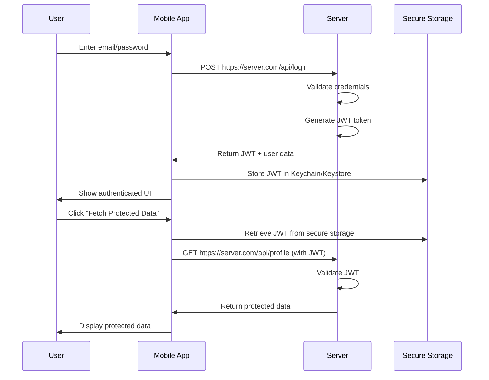
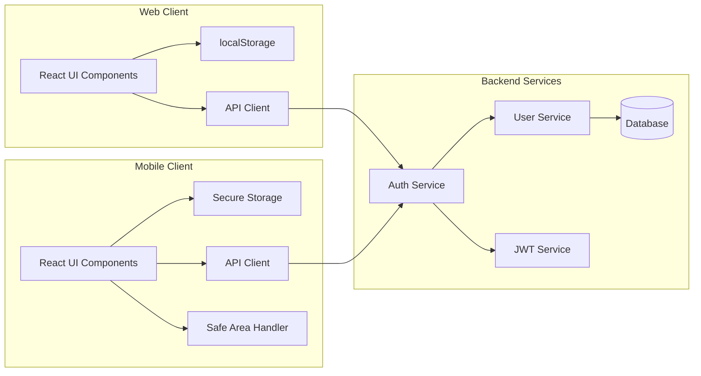
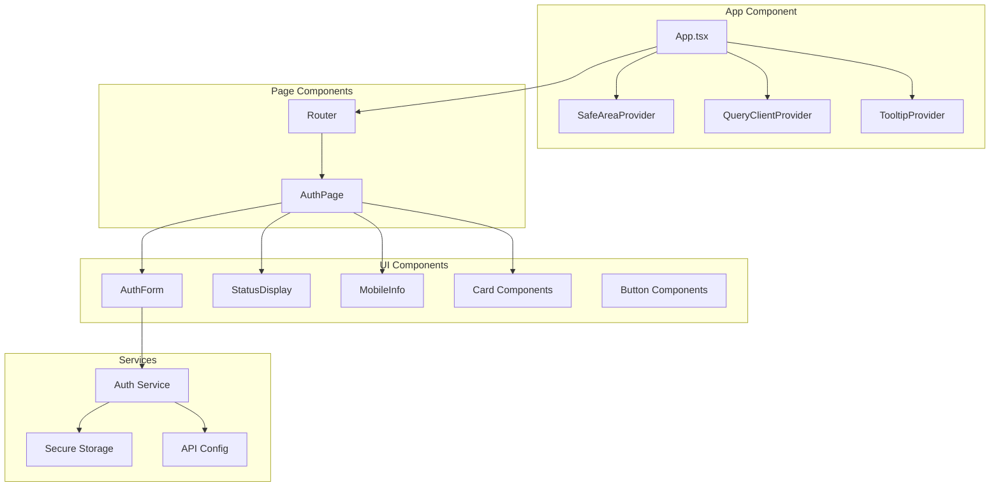
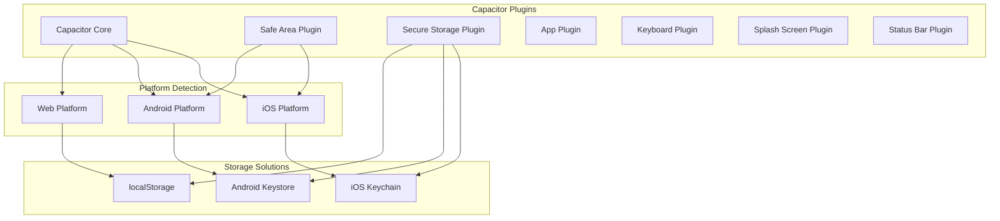
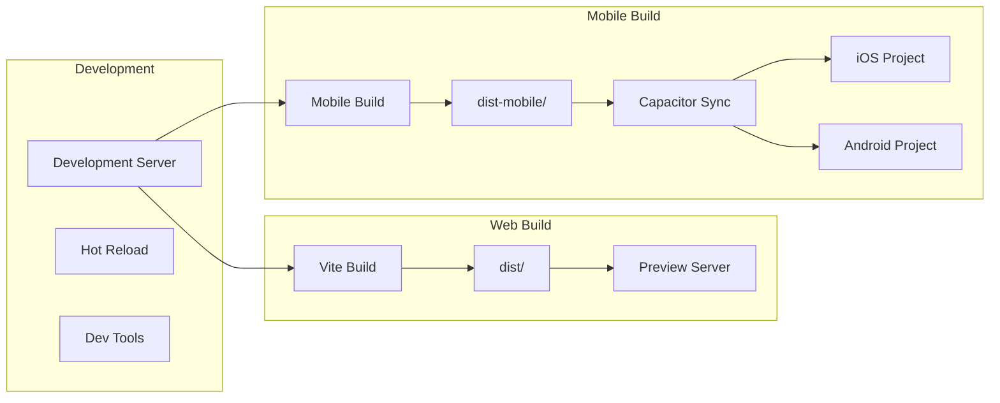
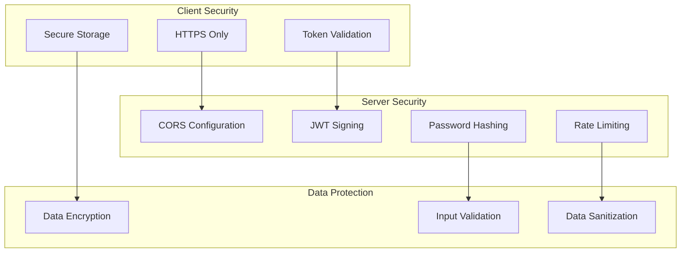
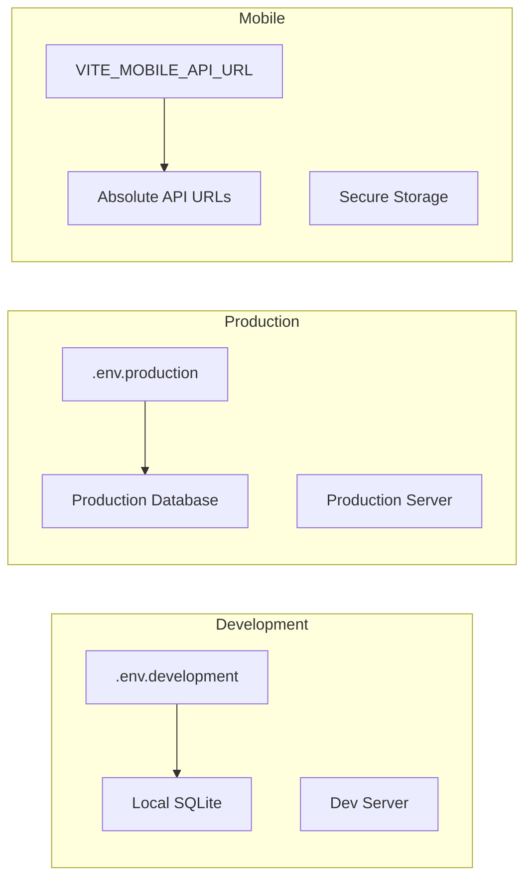
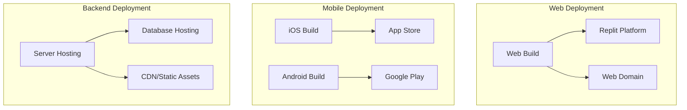

# Application Architecture Diagrams

## System Overview

## Authentication Flow

### Web Authentication Flow

### Mobile Authentication Flow

## Data Flow Architecture

## Component Architecture

## Mobile-Specific Features

## Build Process

## Security Architecture

## Environment Configuration

## Deployment Architecture

